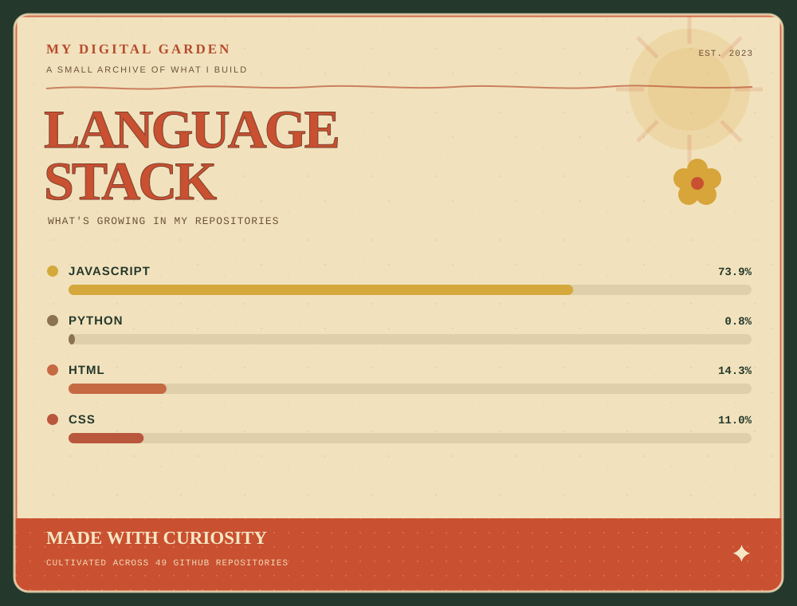

# </img>

### BUILD · LEARN · AUTOMATE

*Build something → break something → understand why → build it better.*

<!-- 
 -->

</img>

## ABOUT ME

I'm a developer who enjoys building things, figuring out how
they work, and occasionally breaking them in the process.

My projects tend to live somewhere between:

     

---

 

</img>

## WHAT I'M INTO

| 🌐 WEB | 🤖 IoT & EMBEDDED | ⚙️ AUTOMATION |
|:---:|:---:|:---:|
| JavaScript | ESP32 | Python |
| HTML | Raspberry Pi | Shell |
| CSS | Sensors | Scripts |
| APIs | Hardware | Tools |

 

## PROJECTS

</img>

### WarrenB BOT

A StockMarked API and server-based website designed to help you make good day-trades, it follows Warren Buffett's strategy.

---

### Project

Lorem Ipsum

</img>

## ✦Connect with me✦

</img>

 MADE WITH CURIOSITY ✦ 

